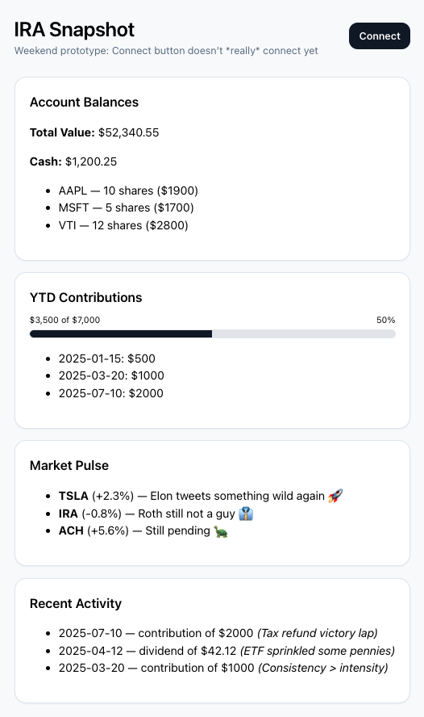
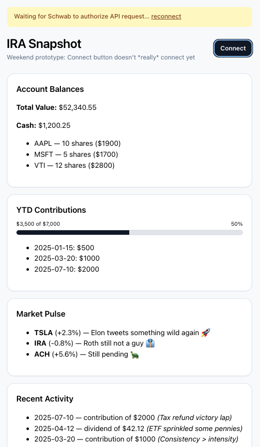

# IRA Snapshot (Demo App)

A lightweight React prototype simulating a retirement account dashboard wired to the **Charles Schwab Open API**.  
This app is **mock-data only** (no real financial connections) and focuses on **API flow awareness**, **user-facing metrics**, and **clean UX**.

> **Why this exists:** to demonstrate product thinking around APIs for a PM role—how data is fetched, surfaced, and turned into simple, helpful insights.

---

<strong>Table of Contents</strong>

- [Demo](#demo)
- [Features](#features)
- [Motivation](#motivation)
- [Architecture](#architecture)
- [Getting Started](#getting-started)
- [Configuration](#configuration)
- [Scripts](#scripts)
- [Screenshots](#screenshots)
- [Roadmap](#roadmap)
- [About Me](#about-me)
- [Disclaimer](#disclaimer)
- [License](#license)

---

## Demo

Local dev: `http://localhost:5173/`

- **Connect** button simulates OAuth (shows an “auth pending” banner)
- **Balances**, **YTD Contributions (+ progress bar)**, **Market Pulse**, **Recent Activity**

---

## Features

- 🔐 **Auth flow awareness:** “Connect” triggers a banner as a stand-in for Schwab OAuth (PKCE). 401 handling is built into the client.
- ⚡ **API client:** `apiClient.js` includes base URL, timeout, retries with backoff, and 401 surfacing.
- 📊 **Metrics that matter:** YTD contributions vs. 2025 IRA limit (progress bar).
- 📰 **Market Pulse feed:** compact, light-hearted headlines to show extensibility.
- 📑 **Recent Activity:** sample contributions/dividends/interest.
- 🧪 **Mock-first design:** real endpoints can replace mocks with minimal changes.

---

## Motivation

Weekend-style prototype to show:

- Comfort with **API-driven UX**: client → data → user value.
- Translating requirements into simple, readable components.
- Focus on **clarity over complexity**—useful for PM roles working with engineering.

---

## Architecture

- **App.jsx** — Main UI (cards, banner, metrics)
- **api.js** — Mock endpoints + shapes
- **apiClient.js** — Fetch wrapper (baseURL, timeout, retries, 401)
- **main.jsx**, **index.css** — App entry + styling

---

## Getting Started

1. Install dependencies:  
   `npm install`

2. Start the dev server:  
   `npm run dev`

3. Open in your browser:  
   `http://localhost:5173/`

---

## Configuration

Create a `.env.local` file (optional but realistic):

- `VITE_API_BASE_URL=`
  - Leave blank for mocks.
  - Point to a real backend later, e.g.:  
    `VITE_API_BASE_URL=https://your-api.example.com`

---

## Scripts

- `npm run dev` — start Vite dev server
- `npm run build` — production build
- `npm run preview` — preview production build locally

---

## Screenshots

  

  

---

## Roadmap

- [ ] Toggle: **Demo / Live** (switch between mocks and real API base URL)
- [ ] Metric: **Avg contribution / month**
- [ ] Polish: **Accessible toasts** (auto-dismiss + screen-reader announcements)
- [ ] Basic **unit tests** for `apiClient` retry/backoff logic
- [ ] Minimal **backend stub** to demonstrate real requests

---

## About Me

Maintained by **Tassiana Lamatina** — a product professional with experience building and scaling solutions used by millions of users worldwide.

- 💻 Skilled in working with **APIs, integrations, and data-driven features**, ensuring technical reliability while keeping the end-user experience front and center.
- 🔧 Hands-on experience partnering with engineers to **debug, test, and validate API calls**, improve error handling, and optimize performance at enterprise scale.
- 📈 Creator and manager of large-scale **early access and customer feedback programs**, translating live client insights into clear product requirements and successful general availability launches.
- 🌍 Background spans **enterprise SaaS platforms and customer-facing products**, with proven ability to manage complexity and deliver results that support tens of millions of users.
- 🚀 Passionate about building products that unify systems, reduce friction, and make complicated workflows simple for customers.

> Goal: demonstrate strong product thinking around API integration, error handling, and translating complex data into clear, user-friendly insights.

---

## Disclaimer

- This is a demo with **mock data**—no financial advice; no affiliation with Charles Schwab.
- Brand names are referenced for demonstration only.

---

## License

MIT
